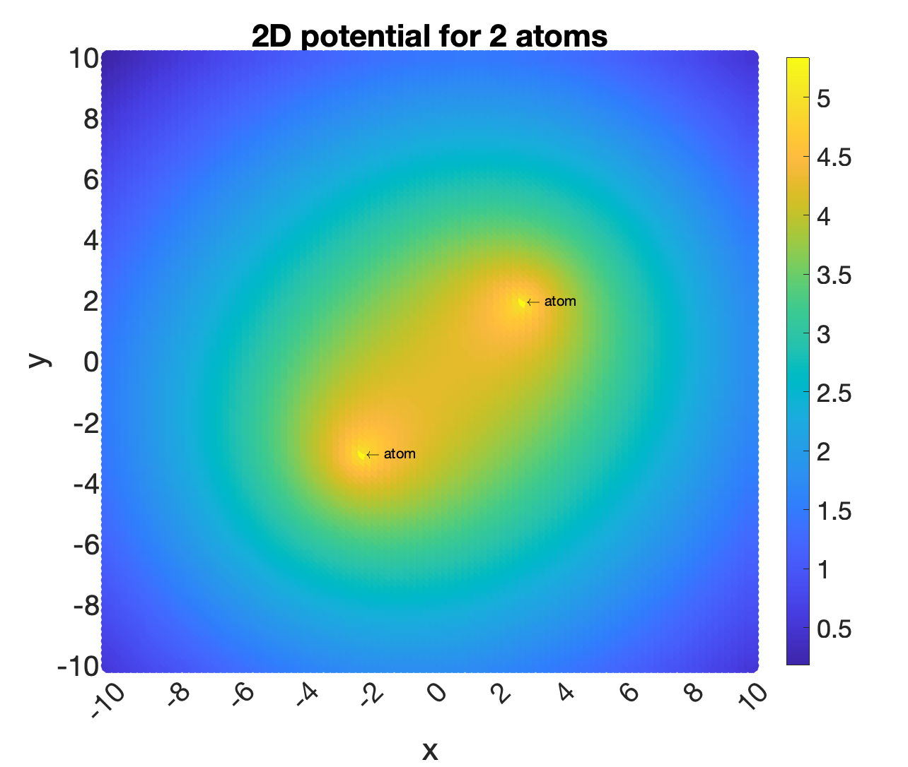

# Physics Inspired Laplacian
Machine learning on complex molecules requires compact, descriptive, and scalable input features. This project expresses features through Laplacian spectra repackaged in the time-independent Hamiltonian operator. This operator from quantum mechanics describes the total energy of a particle system. The Laplacian serves as the kinetic energy component and is computed over a region enclosing the system and is combined with a location-varying potential energy component. This solution offers a model of the physical system leveraging the potential instead of specific element pair interactions as in other graph and geometric methods. Eigenvalues of this operator representing the mechanics of a molecular system, or element specific subsets of a molecule, can then be used for supervised machine learning tasks with for example a gradient boosting decision tree (GBDT) model.


## Feature Generation

For more details on the equations, datasets, and results please see [this write up](https://github.com/eribandogros/PhysicsInspiredLaplacian/files/13956036/writeup.pdf) and my [previous paper](https://doi.org/10.48550/arXiv.2204.12218) on the subject. 

Dependency: MATLAB

To build and run the project, use cmake. Here's an example:

```
mkdir build
cd build
cmake ..
make
./PIL ../dataset/xyz-folder-train/train_0.npy 1 0 g
```

Arguments:
- arg 1, input file: .npy with xyz coordinates of system components
- arg 2, scale: depends on system and potential, 2 options given tailored to kernel 1 or 2, see hamiltonian::set_eta()
- arg 3, operator dimension: 0 or 1
- arg 4, potential kernel char: g (Gaussian), l (Lorentz), q (quadratic), c (cubic)


## Datasets and Preprocessing

To analyze the properties of biomolecules, .mol2 files from widely used datasets undergo minor preprocessing as only atom center locations are needed. The example dataset here includes just the first training and test files from [[1]](#1). See `convertfiles.py` for more details such as element specific conversions.


Preprocessing for model generation requires collecting the features into a single .npy and saving it in `dataset/`. See `collectfiles.py` for more details such as trimming the number of eigenvalues used for learning or catching missing files. Example `train.npy` and `test.npy` are provided in `dataset/` computed from [[1]](#1).


## Model Generation

Once features are extracted and collected, `Model-GBDT.py` trains and tests a GBDT model and outputs learning statistics in `model-gen/results/`. Precomputed training and test features are included in `dataset/`. 

Dependencies: scikit-learn, pandas

```
python Model-GBDT.py
```

## 2D MATLAB Proof of Concept

I have also included the corresponding 2D code written in MATLAB developed prior to the 3D implementation. The first file harmonicOsc2D.m computes the energy and eigenvalues of a harmonic oscillator while the second file locationVarying.m introduces the grid and location varying potential for a small number of atoms. Below is an example of the potential energy generated by two atoms on the grid.

<p align="center">

</p>


## References
<a id="1">[1]</a> 
M. R. Doddareddy, E. C. Klaasse, Shagufta, A. P. IJzerman, and A. Bender, “Prospective validation of a comprehensive in silico herg model and its applications to commercial compound and drug databases,” ChemMedChem, vol. 5, no. 5, pp. 716–729, 2010.
